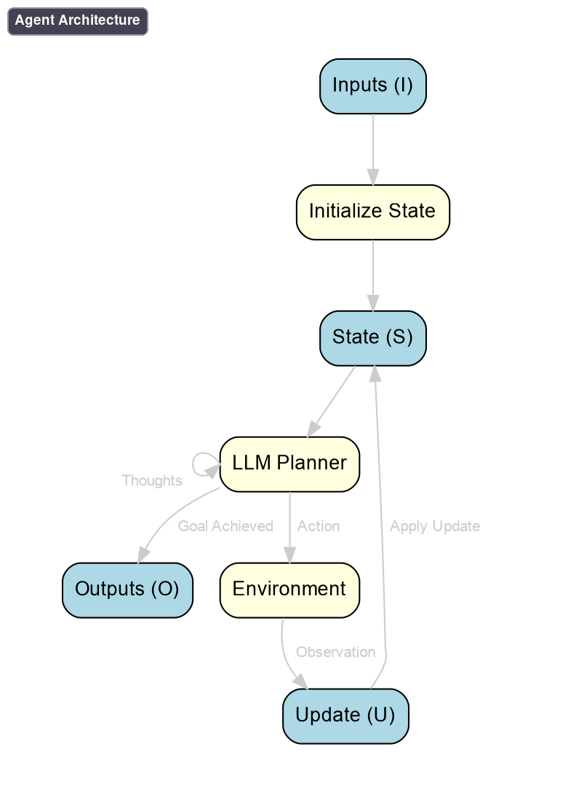

# OneTwo

<div align="center">
  
</div>

<div style=" font-size: 25px; line-height: normal; text-align: justify; max-width: 600px; margin: auto;">
<span style="color: #fbb95d; font-weight: bold;">One</span><span style="color: #fb8987; font-weight: bold;">Two</span> is a python library for developing and deploying LLM
agents in production. In just a few lines of code, you can
<span style="color: #4885ed; font-weight: bold;">define custom agents</span> and combine them with an extensive library of
<span style=" color: #db3236; font-weight: bold;">pre-built
components</span>. </div>

## 🔥 Features

*   **Swap models easily (Model-agnostic)**: Write code once using a uniform API
    and run it on any internal or external model without changing your logic.
*   **Write prompts your way (Convenient syntax)**: Build prompts flexibly using
    formatted strings, Jinja templates, or modular function calls.
*   **Run reproducible experiments**: Automatically cache results to replay
    experiments instantly and save quota without making redundant requests.
*   **Equip models with tools**: Seamlessly integrate external tools, including
    running model-generated Python code in a secure sandbox.
*   **Build and combine agents**: Define and compose stateful agents to perform
    complex, step-by-step actions.
*   **Forget about execution details (Efficient & Flexible)**: Focus on your
    workflow while OneTwo automatically handles asynchronous execution, request
    batching, and smart caching.

## Quick start

### Installation

You may want to install the package in a virtual environment, in which case you
will need to start a virtual environment with the following command:

```shell
python3 -m venv PATH_TO_DIRECTORY_FOR_VIRTUAL_ENV
# Activate it.
. PATH_TO_DIRECTORY_FOR_VIRTUAL_ENV/bin/activate
```

Once you no longer need it, this virtual environment can be deleted with the
following command:

```shell
deactivate
```

Install the package:

```shell
pip install git+https://github.com/google-deepmind/onetwo
```

### 📝 Usage example

```python
from onetwo import ot
from onetwo.builtins import llm
from onetwo.backends import google_genai_api

# Please provide the Gemini API key.
google_api_key = ""

# Select a model + the backend (e.g., Gemini API).
google_genai_api.GoogleGenAIAPI(
    vertexai=False,
    api_key=google_api_key,
    generate_model_name=f'models/gemini-2.5-flash',
    chat_model_name=f'models/gemini-2.5-flash',
).register()

# Define a prompting strategy with two LLM calls.
@ot.make_executable
async def invention_year(technology: str) -> int:
  """Get the year a technology was invented."""
  # First, get the inventor.
  inventor = await llm.instruct(f"Who is the primary inventor of {technology}? Answer with just the name.")
  # Then, get the year of invention.
  year = await llm.generate_object(f"In what year did {inventor} invent {technology}?", cls=int)
  return year


# Run the strategy for a single example.
year = ot.run(invention_year("World Wide Web"))
print(f"The World Wide Web was invented in: {year}")
```

Play with this snippet in the
[getting started tutorial](https://colab.research.google.com/github/google-deepmind/onetwo/blob/main/colabs/getting_started.ipynb).

### 🧠 OneTwo Agents

OneTwo makes it really easy to build stateful, autonomous agents that can
reason, use tools, and solve complex problems. Compose agents naturally using
Python control flow while OneTwo takes care of batching, streaming, and
execution details behind the scenes.



Want to create and play with this agent? Check out our
[in-depth tutorial](https://colab.research.google.com/github/google-deepmind/onetwo/blob/main/colabs/tutorial.ipynb).

### 🔍 Retrieval Augmented Generation

Effortlessly ground your models in custom data. OneTwo provides a streamlined
way to integrate retrieval systems into your workflows, allowing you to build
powerful question-answering systems with minimal boilerplate.

Check out our
[RAG tutorial](https://colab.research.google.com/github/google-deepmind/onetwo/blob/main/colabs/rag_tutorial.ipynb)
to easily create RAG and Question Answering workflows.

### Running unit tests

In order to run the tests, first clone the repository:

```shell
git clone https://github.com/google-deepmind/onetwo
```

Then from the cloned directory you can invoke `pytest`:

```shell
pytest onetwo/core
```

However, doing `pytest onetwo` will not work as pytest collects all the test
names without keeping their directory of origin so there may be name clashes, so
you have to loop through the subdirectories.

## Documentation

Some background on the basic concepts of the library can be found here:
[Basics](docs/basics.md).

Some of the frequently asked questions are discussed here: [FAQ](docs/faq.md).

## Citing OneTwo

To cite this repository:

```bibtex
@software{onetwo2024github,
  author = {Olivier Bousquet and Nathan Scales and Nathanael Sch{\"a}rli and Ilya Tolstikhin},
  title = {{O}ne{T}wo: {I}nteracting with {L}arge {M}odels},
  url = {https://github.com/google-deepmind/onetwo},
  version = {0.4.0},
  year = {2024},
}
```

In the above BibTeX entry, names are in alphabetical order, the version number
is intended to be the one returned by `ot.__version__` (i.e., the latest version
mentioned in [version.py](version.py) and in the [CHANGELOG](CHANGELOG.md), and
the year corresponds to the project's open-source release.

## License

Copyright 2024 DeepMind Technologies Limited

This code is licensed under the Apache License, Version 2.0 (the \"License\");
you may not use this file except in compliance with the License. You may obtain
a copy of the License at http://www.apache.org/licenses/LICENSE-2.0.

Unless required by applicable law or agreed to in writing, software distributed
under the License is distributed on an AS IS BASIS, WITHOUT WARRANTIES OR
CONDITIONS OF ANY KIND, either express or implied. See the License for the
specific language governing permissions and limitations under the License.

## Disclaimer

This is not an official Google product.
